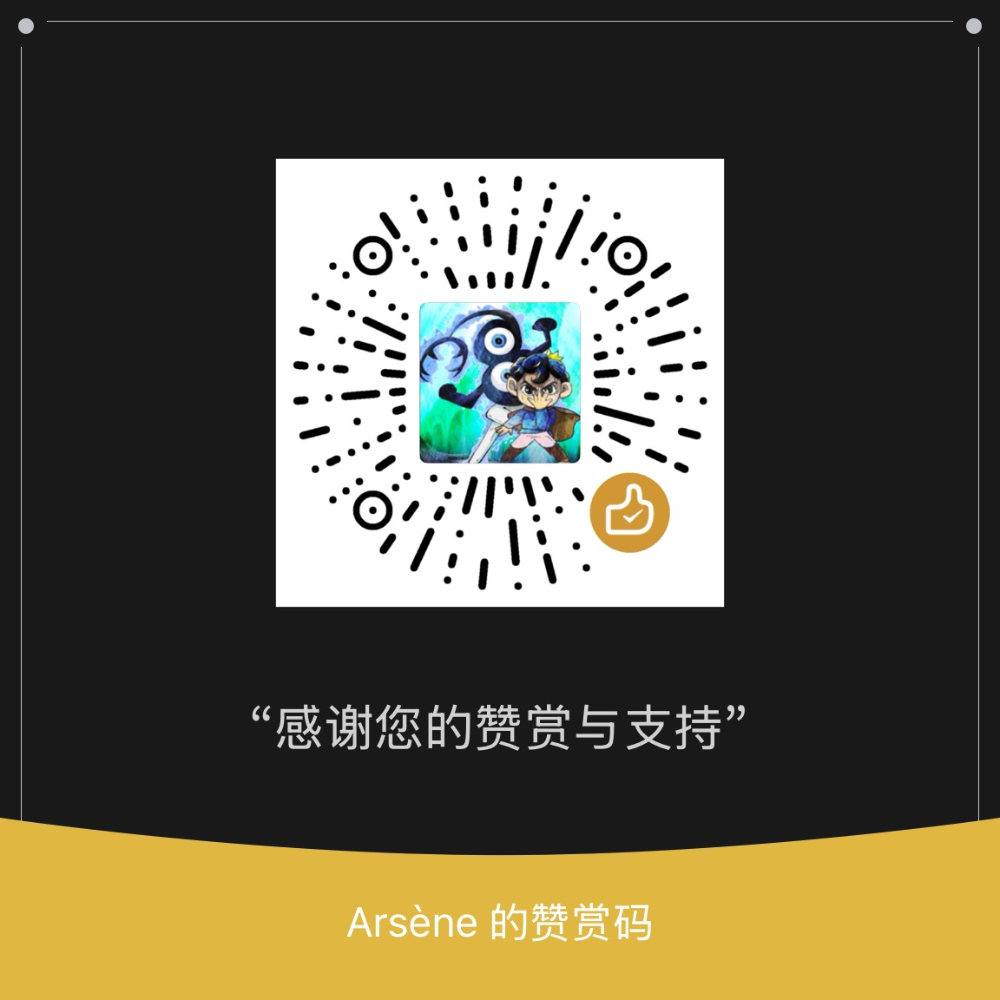

# 即梦AI全能力生成MCP服务

[](https://opensource.org/licenses/MIT)
[](https://www.typescriptlang.org/)
[](https://modelcontextprotocol.io/)

即梦AI全能力生成MCP服务是一个基于Model Context Protocol (MCP)的AI图像和视频生成工具，集成了火山引擎即梦AI(seedream model)的强大生成能力。

## ✨ 核心功能

### 🎨 图像生成
- **文生图3.1**: 基于文本描述生成高质量图像
- **图生图3.0**: 基于参考图片生成新图像
- **图片生成4.0**: 最新版本的图像生成模型(计划中)

### 🎬 视频生成
- **视频生成3.0 Pro**: 基于文本描述生成高质量视频

### 👗 图片换装
- **图片换装V2**: 智能服装更换功能

## 🚀 快速开始

### 环境要求
- Node.js 18+ 
- TypeScript 5.7.2+

### 安装依赖
```bash
npm install
```

### 配置环境变量
创建 `.env` 文件并配置火山引擎API密钥：
```env
JIMENG_ACCESS_KEY=your_access_key_here
JIMENG_SECRET_KEY=your_secret_key_here
```

### 构建项目
```bash
npm run build
```

### 运行测试
```bash
npm test
```

### 快速开始（quick start）

#### 客户端配置（IDE）

在Claude、Trae、cursor等MCP客户端的MCP配置文件中添加以下配置：

```json
{
  "mcpServers": {
    "jimenggen": {
      "command": "npx",
      "args": [
        "jimenggen-mcp@1.1.0"
      ],
      "env": {
        "JIMENG_ACCESS_KEY": "your_access_key_here",
        "JIMENG_SECRET_KEY": "your_secret_key_here=="
      }
    }
  }
}
```

#### 本地运行配置

```json
{
  "mcpServers": {
    "jimenggen": {
      "command": "node",
      "args": [
        "/path/to/jimenggen-mcp/build/index.js"
      ],
      "env": {
        "JIMENG_ACCESS_KEY": "your_access_key_here",
        "JIMENG_SECRET_KEY": "your_secret_key_here"
      }
    }
  }
}
```

## 📋 可用工具

### 文生图 (text-to-image)
基于文本提示词生成图像，支持自定义宽高比和多种艺术风格。

**参数:**
- `prompt`: 图片生成提示词
- `ratio`: 图像宽高比，支持自定义
- `style`: 图片风格（写实、国潮、赛博朋克等）

### 图生图 (image-to-image)
基于参考图片生成新图像，支持风格迁移和内容编辑。

### 视频生成 (text-to-video)
基于文本描述生成高质量视频内容。

### 图片换装 (image-dressing)
智能服装更换功能，支持多种服装类型和保留选项。

## 🔧 技术架构

### 核心技术栈
- **Runtime**: Node.js + TypeScript
- **协议**: Model Context Protocol (MCP)
- **HTTP客户端**: node-fetch
- **图像处理**: sharp
- **数据验证**: zod

### 项目结构
```
jimenggen-mcp/
├── src/
│   ├── index.ts          # 主入口文件
│   └── test.ts           # 测试文件
├── build/                # 编译输出目录
├── package.json          # 项目配置
├── tsconfig.json         # TypeScript配置
└── README.md            # 项目文档
```

## 🔑 API配置

### 火山引擎即梦AI
本项目使用火山引擎即梦AI服务，需要配置以下参数：
- **Endpoint**: `https://visual.volcengineapi.com`
- **Region**: `cn-north-1`
- **Service**: `cv`

### 支持的模型
- `jimeng_t2i_v31` - 文生图3.1
- `jimeng_i2i_v30` - 图生图3.0
- `jimeng_ti2v_v30_pro` - 视频生成3.0 Pro
- `dressing_diffusionV2` - 图片换装V2
- `jimeng_t2i_v40` - 图片生成4.0

## 🎯 使用示例

### 文生图示例
```javascript
// 生成一张赛博朋克风格的未来城市图像
await textToImage({
  prompt: "未来城市夜景，霓虹灯光，赛博朋克风格",
  ratio: { width: 1024, height: 768 },
  style: "赛博朋克"
});
```

### 图生图示例
```javascript
// 基于现有图片生成新风格的图像
await imageToImage({
  prompt: "将这张照片转换为油画风格",
  imageUrl: "https://example.com/original.jpg",
  style: "油画"
});
```

## 🔍 调试信息

服务启动时会显示环境变量检查结果：
```
🔍 MCP服务器启动 - 环境变量检查:
📋 当前环境变量状态:
   JIMENG_ACCESS_KEY: ✅ 已设置 (长度:20)
   JIMENG_SECRET_KEY: ✅ 已设置 (长度:40)
```

## 📝 开发指南

### 添加新工具
1. 在 `src/index.ts` 中注册新的MCP工具
2. 实现对应的API调用函数
3. 更新类型定义和参数验证
4. 添加测试用例

### 扩展模型支持
1. 在 `MODEL_MAPPING` 中添加新模型映射
2. 在 `API_CONFIG_MAPPING` 中配置API参数
3. 实现对应的调用逻辑

## 🐛 故障排除

### 常见问题
1. **API调用失败**: 检查环境变量配置是否正确
2. **图片生成超时**: 调整轮询间隔和最大尝试次数
3. **内存不足**: 优化图片处理逻辑，使用流式处理

### 调试模式
设置 `DEBUG=true` 环境变量启用详细日志输出。

## 🤝 贡献指南

欢迎提交Issue和Pull Request来改进项目！

### 开发流程
1. Fork 项目
2. 创建功能分支
3. 提交更改
4. 推送到分支
5. 创建Pull Request

## 📄 许可证

本项目基于 MIT 许可证开源 - 查看 [LICENSE](LICENSE) 文件了解详情。

## 🙏 致谢

- 感谢火山引擎提供强大的即梦AI服务
- 感谢Model Context Protocol社区
- 感谢所有贡献者和用户

## 📞 联系方式

如有问题或建议，请通过以下方式联系：
- 提交 GitHub Issue
- 发送邮件至项目维护者

## 版本历史

- **v1.0.0**: 初始版本，支持基础的文生图、图生图、视频生成和图片换装功能

## 赞赏

如果本项目对您有帮助，欢迎赞赏支持！

### 赞赏方式
- 微信打赏：扫描下方二维码



---

**注意**: 使用本服务需要遵守火山引擎即梦AI的服务条款和使用规范。
